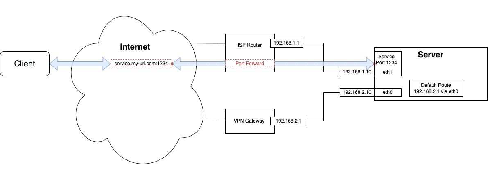
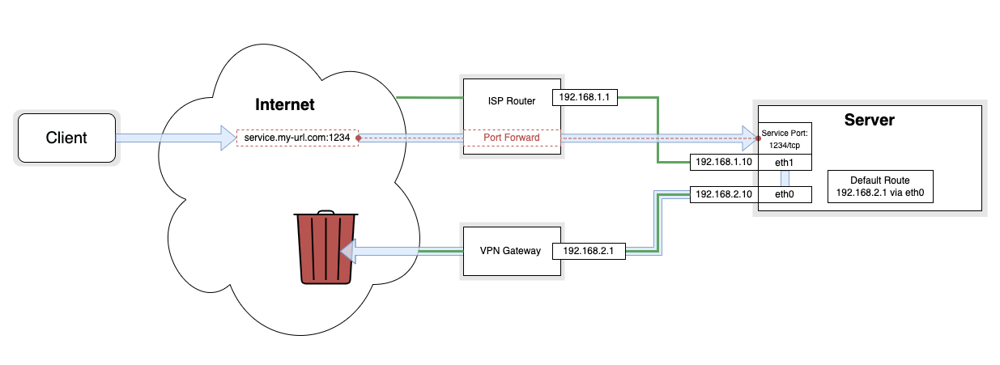

### **⚠️ Beware this service will expose ports from your local network to the internet. I'm not responsible for your improvidence! ⚠️**
­
# Split-Gateway

## **TL:DR**
This service splits your traffic between a default gateway and a external gateway. It will auto-detect services via `ufw` and set/delete the routes accordingly.

Install on Debian 10:
```
sudo apt update && apt install ufw -y
git clone https://github.com/mietzen/split-gateway
sudo bash split-gateway/install.sh
```
Content:

- [What is this?](#what-is-this-)
  * [The Problem](#the-problem)
  * [The Solution](#the-solution)
  * [The Automatization](#the-automatization)
- [Install](#install)
- [Usage](#usage)
- [Uninstall](#uninstall)

# What is this?


## The Problem
Usual all my traffic is routed through a VPN via a VPN Gateway (OpenWRT Router), I now wanted to operate different services on a server in my network and expose the service ports via my normal ISP Router.

### **What I wanted:**


### **What I got:**


UPD packages could reach the service, but no TCP packages, generally speaking the service couldn't answer. This is because the default route is applied for all packages so all outgoing packages where sent over the VPN Gateway and where lost.

## The Solution

## The Automatization

# Install

# Usage

# Uninstall
