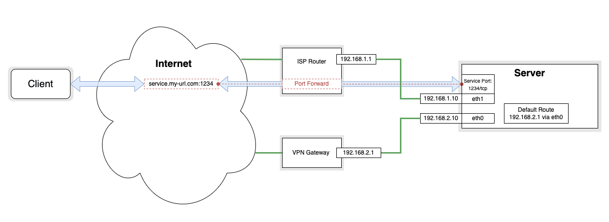

### **⚠️⚠️⚠️                              Beware this service will expose ports from your local network to the internet!                              ⚠️⚠️⚠️**
­
# Split-Gateway

## **TL:DR**
This service splits your traffic between a default gateway and a external gateway. It will auto-detect services via `ufw` and set/delete the routes accordingly.

Install on Debian 10:
```
sudo apt update && apt install ufw -y
git clone https://github.com/mietzen/split-gateway
sudo bash split-gateway/install.sh
```
Content:

- [What is this?](#what-is-this-)
  * [The Problem](#the-problem)
  * [The Solution](#the-solution)
  * [The Automatization](#the-automatization)
- [Install](#install)
- [Usage](#usage)
- [Uninstall](#uninstall)

# What is this?


## The Problem
Usual all my traffic is routed through a VPN via a VPN Gateway (OpenWRT Router), I now wanted to operate different services on a server in my network and expose the service ports via my normal ISP Router.

### **What I wanted:**


### **What I got:**


What happened? In a nutshell service couldn't answer because the default route of the server is applied to all packages, so all outgoing packages where sent over the VPN Gateway. This way packages sent from the service to the client went over the VPN Gateway and where lost.

## The Solution
We need to define a set of rules to tell the server that traffic from our service on port `1234/tcp` to the Internet has a different gateway.
Therefore we need to define a new routing table:
```Shell
$ echo "101 split_gateway" | sudo tee -a /etc/iproute2/rt_tables
```
Now we need to add our route to the new table and add new rule to use this table for all packages marked `1`
```Shell
$ sudo ip route add default table split_gateway via 192.168.2.1
$ sudo ip rule add fwmark 1 table split_gateway
```
After this we need one finale step to mark the packages going outwards from our service port `1234/tcp`
```Shell
$ sudo iptables -t mangle -A OUTPUT ! -d 192.168.2.0/24 -p tcp --sport 1234 -j MARK --set-mark 1 -m comment --comment 'Split-Gateway'
```
## The Automatization
We could add the iptables rule manually for every service port we want to reach from our ISP Router address, but then we must remember to delete this rules when we no longer need one of our services.
Therefore I wrote some systemd services that will:
* Scan `ufw` firewall rules for opened port on the 2nd gateway (e.g. eth1 from the example)
* Delete or add `iptables` if the `ufw` rules are changed
* Scan `ufw` rules for "orphaned" rules, i.e. opened ports with no process listing
* Optional: Open / Close the port on the ISP Router via upnp

When I now create a new service and add it to `ufw`, everything else will work automatically.
# Install

# Usage

# Uninstall
